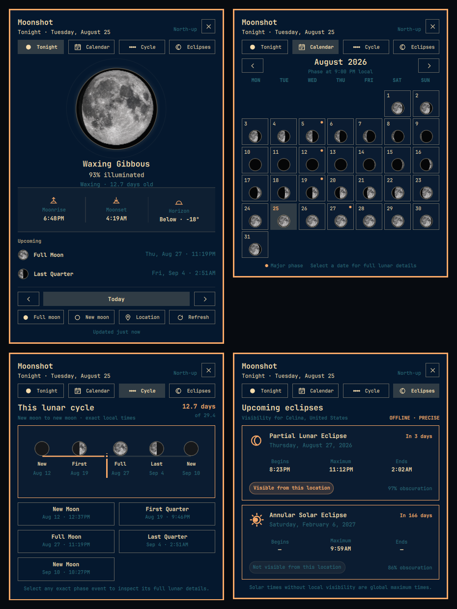

# Moonshot

**The moon, built into your Omarchy desktop.**

Moonshot places a living lunar indicator in the Omarchy bar and opens a calm, location-aware lunar panel with tonight’s Moon, a monthly calendar, an exact cycle timeline, upcoming eclipses, and local moonrise/moonset timings.

## Live Demo



Top: Tonight and Calendar. Bottom: Cycle and Eclipses. These are actual captures from the installed Omarchy popup; only the private location label was removed.

## Features

- **Living Bar Indicator:** Optically centered lunar disk in the status bar with selectable modes (`disk`, `illumination`, `phase`, `next-full`, `moonrise`).
- **Compact Lunar Popup:** A notification-style Omarchy panel anchored to the bar, with a realistic texture-backed north-up lunar disk, computed phase terminator, illumination stats, direction, and moon age.
- **Lunar Calendar:** Browse any month as miniature, locally calculated moon disks; exact New, Quarter, and Full Moon dates are marked and every day opens its detailed view.
- **Cycle Timeline:** See the selected instant’s exact position from New Moon to New Moon, with local dates and times for all five cycle anchors.
- **Eclipse Tracking:** Follow the next lunar and solar eclipses with exact classification, maximum/contact times, countdown, obscuration, and observer-local visibility.
- **Accurate Astronomical Ephemeris:** Offline computation powered by Astronomy Engine with validated USNO/NASA golden data.
- **Local Rise, Set & Horizon:** Precise local-day rise and set calculations with upper-limb and refraction corrections.
- **Date Browsing:** Step through past or future dates with smooth transitions and quick jumps back to Today or the next Full/New Moon.
- **Location Flexibility:** Works fully offline with manual coordinates & IANA time zone, or via optional city search (Open-Meteo).
- **Travel-Friendly Places:** Keeps up to six validated places for one-click switching; clear the active location without losing them, or reset everything with confirmation.
- **Omarchy Native:** Theme-adaptive palette, smooth popout lifecycle, keyboard accessibility, and reduced-motion support.
- **Zero Tracking:** No telemetry, analytics, tracking, or background daemons.

## Requirements

- **Omarchy:** 4.0.0 or higher
- **Shell:** Quickshell 0.3.0+
- **Python:** Python 3.10+ (standard library only; Astronomy Engine is vendored in-repo)

## Installation

Install directly into your Omarchy shell using the Omarchy plugin CLI:

```bash
omarchy plugin add https://github.com/rodrix2000/omarchy-moonshot.git --enable
```

To enable or reposition the widget manually in your status bar:

```bash
omarchy bar move io.github.rodrix2000.moonshot --section right
```

## Usage

- **Click Bar Icon:** Toggle the Moonshot popup.
- **Middle-Click Bar Icon:** Force recalculation and refresh.
- **Right-Click Bar Icon:** Cycle the bar display mode for the current shell session.
- **Keyboard Shortcuts (inside panel):**
  - <kbd>Left</kbd> / <kbd>Right</kbd>: Previous / Next day
  - <kbd>T</kbd>: Jump to Today (current instant)
  - <kbd>F</kbd>: Jump to next Full Moon
  - <kbd>N</kbd>: Jump to next New Moon
  - <kbd>Shift</kbd>+<kbd>L</kbd>: Open Location Editor (`l` remains Vim-style Next day)
  - <kbd>R</kbd>: Refresh calculations
  - <kbd>1</kbd> / <kbd>2</kbd> / <kbd>3</kbd> / <kbd>4</kbd>: Tonight / Calendar / Cycle / Eclipses
  - <kbd>Escape</kbd>: Close Location Editor or dismiss Moonshot

## Location & Privacy

- **Offline-First:** All ephemeris calculations run locally on your system.
- **No Location Mode:** If unconfigured, global moon phase, illumination, and age are computed immediately without needing coordinates.
- **Manual Mode:** Provide your latitude, longitude, and IANA time zone directly for 100% offline rise/set computation.
- **Local Eclipse Visibility:** Observer circumstances are calculated locally with the vendored astronomy engine; no coordinates are sent anywhere.
- **City Search:** Optional geocoding queries Open-Meteo over HTTPS. No location data is sent in the background.
- **Local State:** A validated location is stored atomically in `${XDG_STATE_HOME:-$HOME/.local/state}/moonshot/settings-v1.json` with user-only permissions. Host-provided plugin settings take precedence when present.
- **Saved Places:** Each validated location moves to the front of a six-place local list. `Clear active` returns to no-location mode while retaining that list; `Reset all` clears both after a confirming second click.

## Rendering Convention

> **Note:** Moonshot v1 renders the lunar disk using a standard north-up astronomical chart convention (waxing light on right, waning on left). The phase silhouette is computed, while the neutral lunar albedo texture is illustrative rather than a scientific surface map. Local horizon disc rotation is not simulated.

The popup uses Omarchy semantic surface, text, accent, muted, urgent, spacing, border, and focus tokens. The lunar texture stays neutral so it remains recognizable across light, dark, tinted, and high-contrast themes; theme color is limited to surrounding glow, rim, controls, and text.

## Updating

```bash
omarchy plugin update io.github.rodrix2000.moonshot
```

## Removal

```bash
omarchy plugin remove io.github.rodrix2000.moonshot
```

To clean up local state cache:

```bash
rm -rf "${XDG_STATE_HOME:-$HOME/.local/state}/moonshot"
```

## Third-Party Software

Moonshot vendors [Astronomy Engine](https://github.com/cosinekitty/astronomy) by Don Cross under the MIT License. See [THIRD_PARTY_NOTICES.md](THIRD_PARTY_NOTICES.md) for details.

## License

MIT License — Copyright (c) 2026 Rudy Rodriguez. See [LICENSE](LICENSE) for details.
